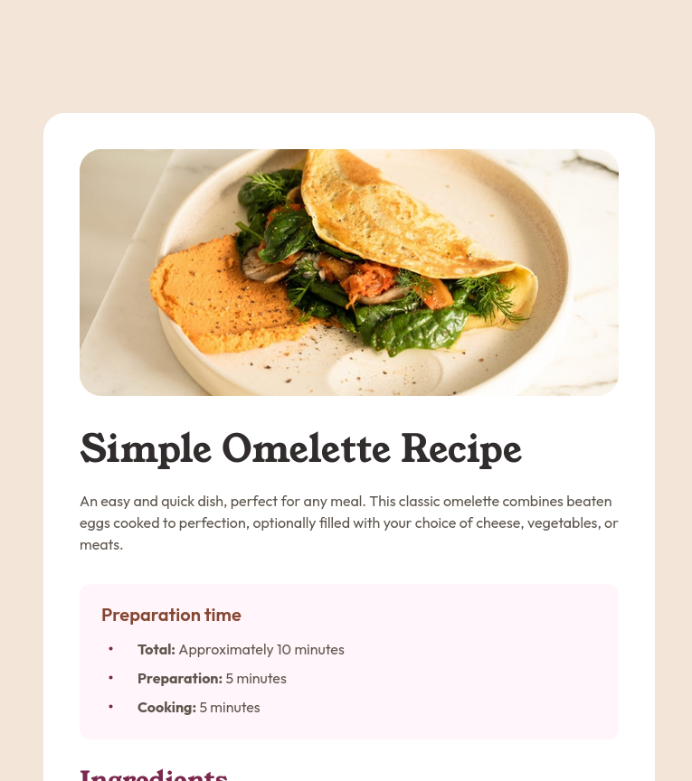

# Frontend Mentor - Recipe page solution

This is a solution to the [Recipe page challenge on Frontend Mentor](https://www.frontendmentor.io/challenges/recipe-page-KiTsR8QQKm). Frontend Mentor challenges help you improve your coding skills by building realistic projects.

## Table of contents

- [Overview](#overview)
  - [Screenshot](#screenshot)
  - [Links](#links)
- [My process](#my-process)
  - [Built with](#built-with)
- [Author](#author)
- [Acknowledgments](#acknowledgments)

## Overview

Recipe page challenge build with HTML and CSS.

### Screenshot

### Links

- Solution URL: [Github](https://github.com/VirginiaPat/recipe-page-main.git)
- Live Site URL: [Netlify](https://recipe-card-virgi.netlify.app/)

## My process

### Built with

- Semantic HTML5 markup
- Flexbox
- Mobile-first workflow

## Author

- Frontend Mentor - [@VirginiaPat](https://www.frontendmentor.io/profile/VirginiaPat)
- Github - [VirginiaPat ](https://github.com/VirginiaPat)
- Netlify - [VirginiaPat](https://app.netlify.com/teams/virginia-patrika/sites)

## Acknowledgments

Special thanks to Kamran Kiani [@kaamiik](https://www.frontendmentor.io/profile/kaamiik) for his feedback.
